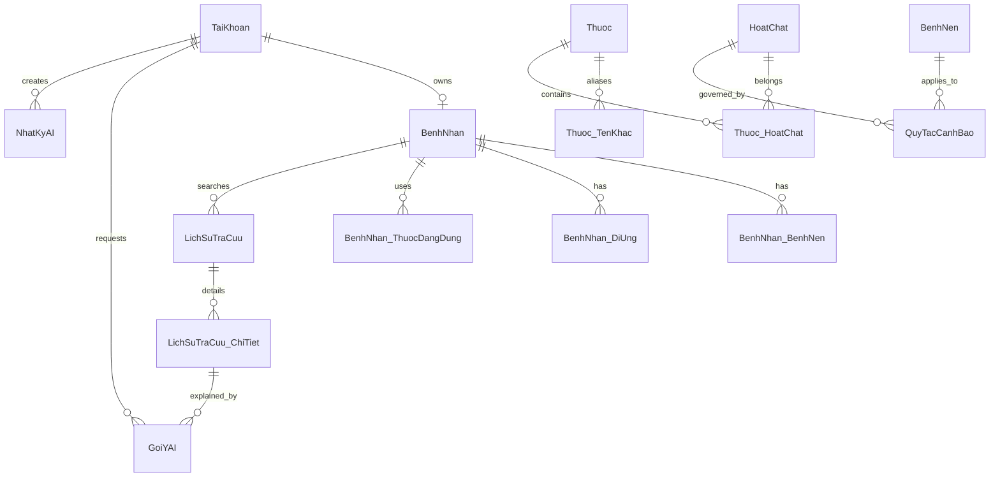

# ERD cập nhật

Thay đổi v2:

- `TaiKhoan`: `Email`, `GoogleId`, `AnhDaiDien`, `LoaiDangNhap`.
- `Thuoc`: `TenQuocTe`, `CanKeDon`; bổ sung `Thuoc_TenKhac` cho schema demo.
- `GoiYAI`: nội dung AI và trạng thái kiểm duyệt.
- `NhatKyAI`: audit đầy đủ, giữ tối thiểu 90 ngày theo chính sách vận hành.

Migration idempotent: `src/main/resources/migration-v2.sql`.

